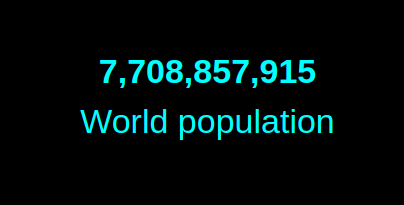
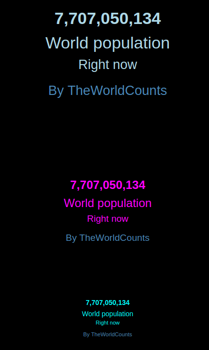

## MMM-PopulationClock

Live World Population Clock

## Examples

* Large, medium or small

* Config option for text color





## Installation

* `git clone https://github.com/mykle1/MMM-PopulationClock` into the `~/MagicMirror/modules` directory.

## Config.js entry and options

```
    {
          disabled: f,
        module: "MMM-PopulationClock",
        position: "middle_center",
        config: {
          size: "large", // small, medium or large
          textColor: "cyan", // only names, not codes
        }
      },
```

